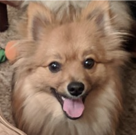

# Stanford Code in Place Final Project

## Simba Friends Twitter Bot

Simba; Photo Credit: Chris Piech

[Simba Friends Twitter Bot](https://twitter.com/SimbaFriendsBot) was inspired by Simba, the adorable Stanford Code in Place dog. Using [Python](https://www.python.org/) programming language and [Requests](https://requests.readthedocs.io/en/master/), [Pillow](https://pillow.readthedocs.io/en/stable/), and [Twython](https://twython.readthedocs.io/en/latest/) libraries, I created a bot that downloads a pet photo from the Unsplash curated "[Personable Pets](https://unsplash.com/collections/2489501/personable-pets)" collection, modifies it with a randomly chosen image filter algorithm, and tweets the photo on the Simba Friends Bot Twitter account. 

### GitHub Actions Proof of Concept

Initially, I got the bot working locally. But my stretch goal was to figure out how to run the bot solely via [GitHub Actions](https://github.com/features/actions). I wasn't sure if this was even possible, because a photo would need to be downloaded, modified, saved, and tweeted via GitHub Actions for all of this to work. Amazingly, I was able to create a successful proof of concept!

Table of Contents
-----------------

* [Program Steps Summary](#program-steps-summary)
* [Milestones](#milestones)
  * [Milestone 1- Download the Image](#milestone-1--download-the-image)
  * [Milestone 2- Modify the Image](#milestone-2--modify-the-image)
  * [Milestone 3- Tweet the Image](#milestone-3--tweet-the-image)
  * [Milestone 4 (Experimental)- Run the Bot via GitHub Actions](#milestone-4-experimental--run-the-bot-via-github-actions)
  * [Milestone 5- Publish and Publicize](#milestone-5--publish-and-publicize)
  * [Milestone 6- Submit](#milestone-6--submit)
* [Possible Enhancements](#possible-enhancements)

## Program Steps Summary

* Download a random image from an Unsplash curated "Personable Pets" collection
* Randomly choose an image filter algorithm from a list
* Call that image filter algorithm function to apply the filter to the image
* Tweet the modified image to a Simba Friends Bot Twitter account, using the Twitter API and Twython
* Delete the image

## Milestones

### Milestone 1- Download the Image

* At this time, the "Personable Pets" collection contains 278 images
* An individual image in the collection can be identified using the collection ID and file number
* Use `randrange()` function to choose a random `file_number` between 1 and 278, inclusive
* Create a string using the collection URL and ID and insert the `file_number` at the end
* Use the Requests library to download the image (optionally, use a `photos/` directory)
* Open the image using the Pillow library and show the image locally before transformation

### Milestone 2- Modify the Image

* Unfortunately, Twython, Pillow, and SimpleImage were not compatible, so I used Pillow directly
* My SimpleImage algorithms are commented out at the bottom of this file
* Pass list of image filter algorithms into `random.choice()` to randomly choose an algorithm
* The chosen image filter algorithm function will be called, passing in the `new_image` and `file_path`
* After the algorithm is applied, `save_image()` function will be called to save and return the modified image
* Optionally, uncomment `modified_image.show()` to show the image locally after transformation

### Milestone 3- Tweet the Image

* Open the modified image
* Using Twython, upload and tweet the modified image, optionally with a `status` message
* Call the `remove_file()` function to delete the image
* Check your terminal and the associated Twitter account to verify tweet posted! 

### Milestone 4 (Experimental)- Run the Bot via GitHub Actions

* Create a GitHub Action that can cache the downloaded photo so the bot can be run from GitHub

### Milestone 5- Publish and Publicize

* Add PyPI packaging configurations to the GitHub repo where the code is hosted
* Create a GitHub Action that can auto-publish the package when a release is tagged on GitHub
* Tag the release and verify published to PyPI
* Create a README.md with instructions for how to use the code
* Create a blog post for fun, explaining how to set up this bot

### Milestone 6- Submit

* Make assignment video and submit assignment :)
* Sit back, drink some tea, and enjoy some cute animal photos at https://twitter.com/SimbaFriendsBot 

## Possible Enhancements

* Create a local cron job to run the bot at regular intervals (not necessary if using GitHub Actions)
* Add a photographer credit (not required by Unsplash) as the status update
